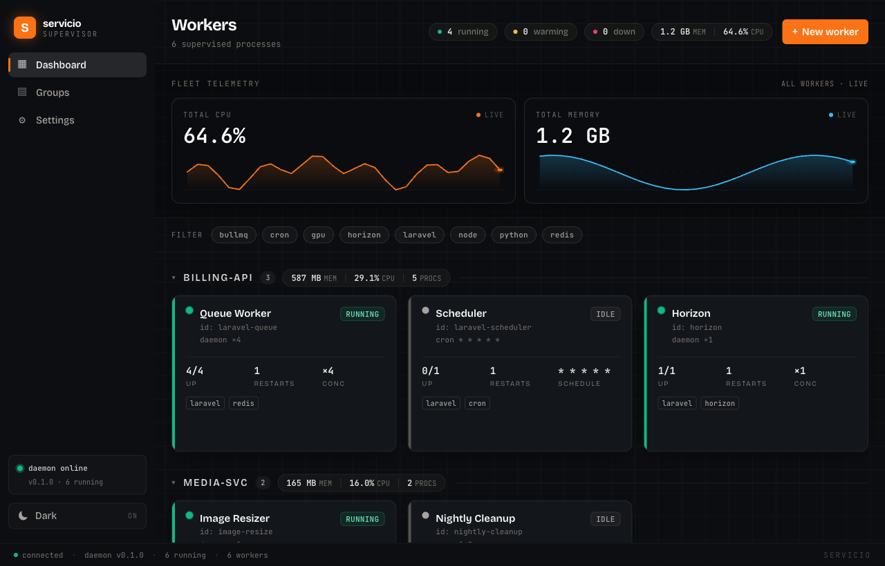
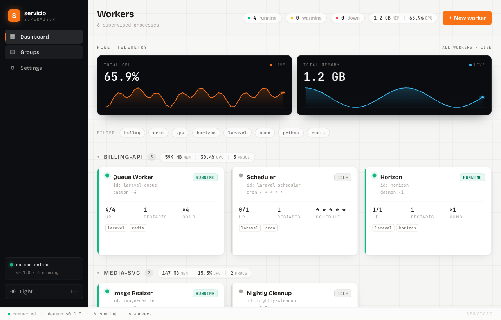
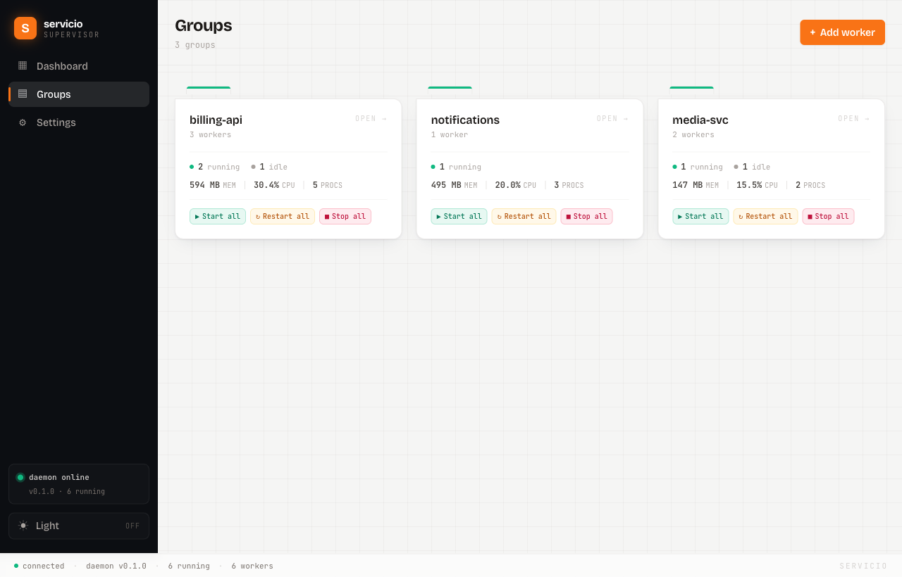
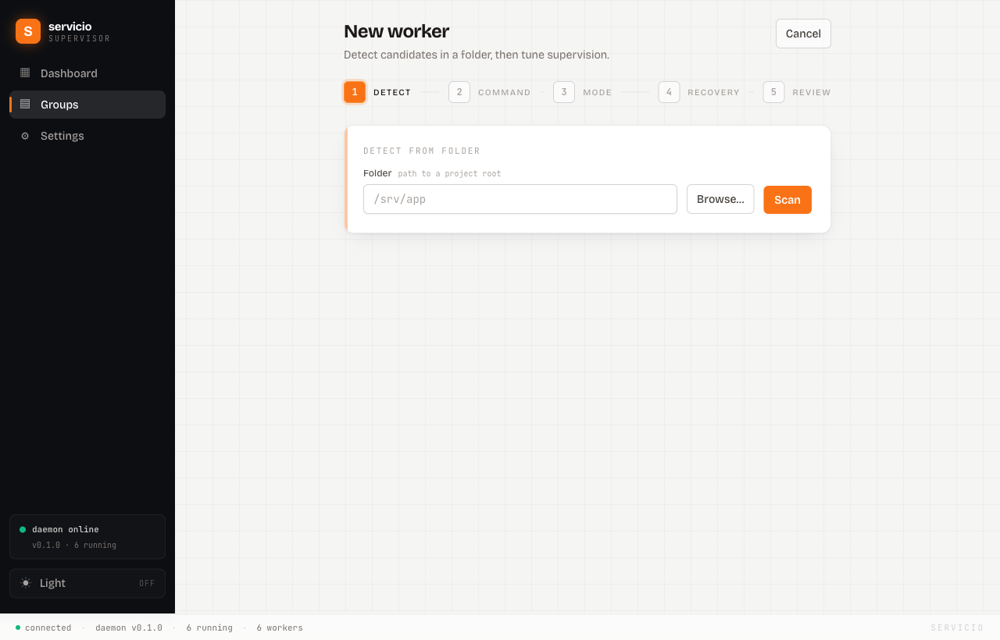

<div align="center">


# Servicio

Keep your background dev processes running without babysitting them.

[](https://github.com/AdnanHussainTurki/servicio/actions/workflows/ci.yml)
[](https://github.com/AdnanHussainTurki/servicio/releases)
[](LICENSE)

</div>



Servicio watches the long-running commands you'd otherwise leave open in terminal tabs (queue workers, dev servers, cron jobs, the odd one-off script) and looks after them: it restarts the ones that die, brings them back when you log in, and keeps their logs and resource use in one window.

## Why

If you work on anything with background jobs, you know the routine. A couple of tabs running `queue:work`, a Vite server, maybe a scheduled task, and every so often one of them quietly stops and you don't notice until something downstream breaks.

Servicio takes over that bookkeeping. Point it at a project, let it work out what can run, and it keeps those processes going. It's a normal desktop app with a small background helper. There are no config files to write by hand and nothing to keep an eye on.

## What it does

- Restarts processes when they crash, backing off so a broken command doesn't spin in a tight loop.
- Starts your processes when you log in, as an ordinary user service (no `sudo`).
- Shows live logs and CPU/memory for each process, grouped however suits you.
- Looks at a project folder and suggests what to run: Laravel queues, Procfiles, crontabs, VS Code tasks, Node scripts, and Python entry points.
- Runs things three ways: always on, on a schedule (cron or an interval), or a set number of times.
- Starts, stops, or restarts a whole group at once, and imports or exports your setup as JSON.

## Screenshots

| Dashboard | Groups |
| --- | --- |
|  |  |

| New-worker wizard | Dark mode |
| --- | --- |
|  |  |

## Install

**macOS.** Grab `Servicio_<version>_universal.dmg` from the [latest release](https://github.com/AdnanHussainTurki/servicio/releases), open it, and drag Servicio to Applications. The builds aren't notarized yet, so on first launch right-click the app and choose Open (or run `xattr -dr com.apple.quarantine /Applications/Servicio.app`).

**Linux.** Installers (`.deb`, `.rpm`, `.AppImage`) are attached to each release. The daemon installs as a `systemd --user` service.

**Windows.** Installers (`.msi`, `.exe`) ship with each release. Treat Windows as early days; the core engine is cross-platform and the rest is being smoothed out.

Signing and notarization are still being set up. Until then you'll see the usual "unidentified developer" steps above. See [`docs/RELEASING.md`](docs/RELEASING.md) for the details.

## Using it

1. Open Servicio. It starts and supervises its background daemon for you.
2. Add a worker. Point the wizard at a project folder and pick from what it finds, or type a command yourself.
3. Choose how it runs: always on, on a schedule, or a fixed batch.
4. Open a worker to watch its logs and resource use. Group related ones and control them together.
5. Turn on "Start on login" in Settings so everything comes back after a reboot.

If you'd rather stay in the terminal, the same daemon answers a `servicio` CLI:

```bash
servicio ps                 # workers and their state
servicio start queue        # start or stop a worker
servicio logs queue         # follow a worker's logs
servicio metrics queue      # CPU and memory samples
servicio detect ~/app       # scan a folder for things to run
```

## Build from source

You'll need [Rust](https://rustup.rs) (stable), [Node 20+](https://nodejs.org), and the [Tauri prerequisites](https://tauri.app/start/prerequisites/) for your OS (Xcode command-line tools on macOS; `webkit2gtk` and friends on Linux).

```bash
git clone https://github.com/AdnanHussainTurki/servicio.git
cd servicio

# Engine, CLI, and daemon (Rust workspace)
cargo build --release
cargo test

# Desktop app
cd apps/desktop
npm ci
npm run tauri dev           # run against a dev daemon
```

For a distributable universal macOS build:

```bash
cd apps/desktop
PATH="$HOME/.cargo/bin:$PATH" npm run build:universal
```

## How it fits together

Servicio is a Rust workspace plus a Tauri desktop app. The app is mostly a window onto a small headless daemon that does the actual supervising and keeps its state in SQLite. They talk over a local socket, and the same daemon also backs the `servicio` command-line client, so the GUI and CLI always agree on what's running.

If you want to read the code, the daemon and engine live under `crates/` and the desktop app under `apps/desktop`.

## Roadmap

- Packaged, signed, and notarized releases for every platform.
- Saved dashboard views and richer tag filtering.
- More project detectors (Symfony, Rails, docker-compose).
- A hosted update endpoint.

The [design notes](docs/superpowers/specs/) have the longer history if you're curious.

## Contributing

Bug reports, features, new detectors, and docs are all welcome. [CONTRIBUTING.md](CONTRIBUTING.md) covers the setup and the style checks (`cargo fmt`, `clippy`, and `eslint`, all run in CI). The quick version:

```bash
cargo test && (cd apps/desktop && npm run test && npm run lint)
```

Then fork, branch, and open a pull request against `main`.

## License

[MIT](LICENSE) © 2026 Adnan Hussain.
